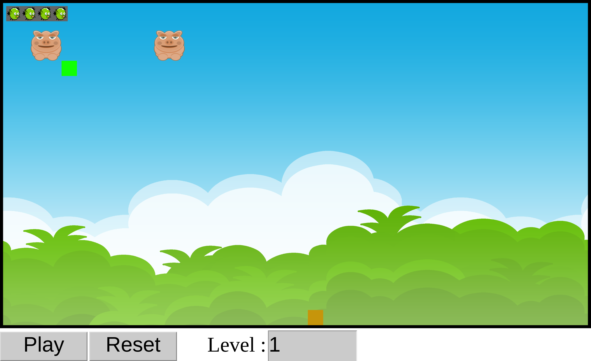

# AngryJS

- BERRIEN Samuel
- PENUCHOT Jules

- GitHub : https://github.com/ipsedo/AngryJS
- Site : https://ipsedo.github.io/AngryJS/

## Présentation générale du projet

Le projet est une réplique du jeu Angry Birds en JavaScript, destiné à être utilisé dans un navigateur internet.

Voici le détail de la structure du jeu :

```
controls.js     - Gestion des contrôles
entity.js       - Définition des entités
explosion.js    - Gestion des explosions
game.js         - Mécaniques du jeu (gameplay)
level_loader.js - Chargement des niveaux
physics.js      - Moteur physique
sprite.js       - Gestion de l'affichage
vector.js       - Algèbre vectorielle
```

Le fonctionnement du jeu est simple : des ennemis sont présents sur la map, le joueur peut leur infliger des dommages proportionnels à la force des collisions infligées pour les faire exploser à l'aide d'oiseaux en guise de projectiles et il remporte la partie dès qu'il n'y a plus d'ennemis sur la map.

## Interface



Les boutons **Play/Pause** et **Reset** permettent respectivement de mettre le jeu en pause ou le relancer lorsque la fenêtre perd le focus et de remettre le niveau à zéro pour relancer la partie.

Le sélecteur Level permet de parcourir les niveaux stockés dans `res/levels`.

## Fonctionnalités

Le moteur du jeu permet de créer des niveaux **totalement sur mesure** et d'ajuster énormément de paramètres pour chaque objet tels que :

- Ses attributs relatifs au jeu (ennemi ou non, son nom, sa vie de départ...)
- Son sprite (le cas échéant sa couleur)
- Ses attributs physiques (masse, taille de la hitbox, vitesse de départ,  etc.)

Ce choix permet d'avoir un moteur de jeu dont le code sera très peu amené à changer et dont les niveaux peuvent être très variables pour proposer une large variété de gameplays différents.

En plus des entités (corps, ennemis etc.), les fichiers de niveau stockent également les munitions mises à disposition du joueur pour remporter la partie.

## Le projet plus en détails

### Le jeu

Le jeu est entièrement piloté par le script `game.js` qui gère la liaison des entités modèle (`game.js`/`physics.js`/`entity.js`), vue (`sprite.js`) et contrôleur (`controls.js`).

Une fois la liaison effectuée il veille au déroulement des parties, CàD le chargement des niveaux, la vérification de présence d'ennemis etc. pour afficher le message de victoire au joueur, etc.

### Le moteur physique

Le moteur physique est assez simple, il ne gère que les collisions et les frottements à l'air ainsi que la **gravité**. La gravité, conjointement à la flexibilité du moteur énoncée avant, permet de créer des attracteurs. La gravité globale du niveau par exemple se fait grâce à une entité fixée dans le code, représentant la Terre (dimensions et forces à l'échelle réelle). L'ajout d'un corps massif permettrait par exemple de créer un niveau où la gravité est quasi-nulle, et certains corps (comme le corps vert dans le 1er niveau) font office d'attracteurs.

Le moteur physique repose très largement sur la librairie `vector.js` qui implémente une algèbre linéaire sur laquelle repose tous nos calculs vectoriels à travers le jeu. Un rectangle par exemple est représenté par un vecteur dimensions ainsi qu'un vecteur position.

Cette algèbre permet d'avoir un code dont les opérations vectorielles sont **lisibles** et implémentées dans le style de JavaScript (à savoir `objet.méthode().méthode(objet.méthode())...`).

Quelques fonctionnalités ont été implémentées pour lisser la physique et ne pas de rebonds infinis, par exemple. Un frottement à l'air a également été implémenté.

### Le rendu

Le rendu est effectué grâce à `sprite.js`. Cette classe est **complètement dissociée** du moteur physique pour plus de flexibilité. Chaque entité compte donc un sprite et une entité physique (rectangle) et les deux calculs sont effectués de manière totalement indépendante. Le sprite faisant appel à l'entité physique pour effectuer le rendu.

`sprite.js` permet donc de regrouper chaque drawable sous une interface commune `Sprite` qui compte `draw()` comme méthode virtuelle et `setColor()` comme méthode héritée. Chaque entité `Sprite` se voit passer le contexte en argument pour qu'elle puisse gérer elle-même son propre rendu.

### Les niveaux

Les niveaux sont stockés dans des fichiers **JSON** qui décrivent assez exhaustivement les propriétés de chaque objet. Le script `level_loader.js` s'en charge en prenant le temps de vérifier que les objets sont bien formés.

Le script gère également la **récupération des niveaux** via internet (en l'occurrence sur le site en local).

La structure des fichiers JSON est entièrement détaillée dans l'en-tête du script en commentaire.

### Les contrôles

Les contrôles eux sont gérés par le script `controls.js` qui s'occupe d'observer les clics du joueur afin de détecter le début et la fin d'un lancer d'oiseau. À noter que le script reconnaît également le toucher sur les ordinateurs tactiles.

## Pour finir

Le projet a été mené à bien assez rapidement, JavaScript étant fait pour des projets interactifs qui ne requièrent pas particulièrement d'optimisation. Nous avons travaillé en binôme grâce à Git, le jeu lui est en ligne via GitHub Pages. Le debug en revanche a été fait sur des serveurs web locaux.
